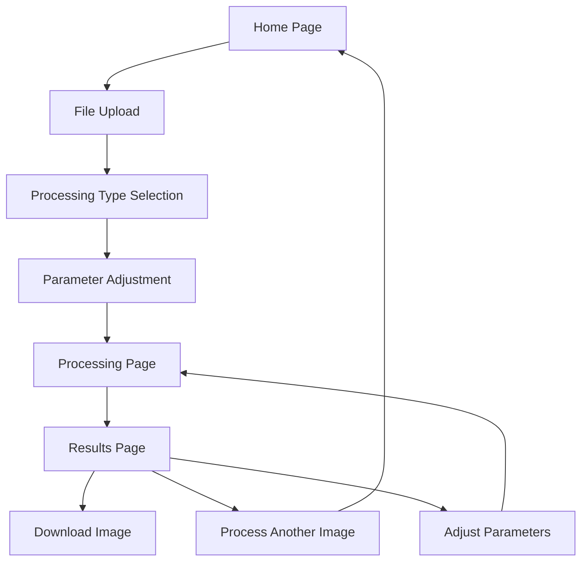

# Image Processing Web Application - Product Requirements Document

## 1. Product Overview
A web-based image processing platform that provides users with powerful image compression tools through an intuitive interface. Users can upload JPG images and choose between quality-based compression or pixel reduction compression to optimize their images for different use cases.

The application solves the common problem of large image file sizes by offering two distinct compression approaches: maintaining image dimensions while reducing file size, or reducing both dimensions and file size for maximum space savings. Target users include photographers, web developers, content creators, and anyone needing to optimize images for web or storage.

## 2. Core Features

### 2.1 User Roles
No user registration required - the application operates as a public utility tool accessible to all users without authentication barriers.

### 2.2 Feature Module
Our image processing web application consists of the following main pages:
1. **Home Page**: Hero section with tool introduction, drag-and-drop upload area, processing type selection, and quick start guide.
2. **Processing Page**: Real-time processing interface, progress indicators, parameter adjustment controls, and processing status updates.
3. **Results Page**: Before/after image comparison, detailed processing statistics, download options, and processing history for the session.

### 2.3 Page Details

| Page Name | Module Name | Feature description |
|-----------|-------------|---------------------|
| Home Page | Hero Section | Display application title, brief description of compression capabilities, and visual examples of before/after results |
| Home Page | Upload Area | Drag-and-drop file upload interface with file validation, preview thumbnails, and support for JPG/JPEG formats |
| Home Page | Processing Selection | Radio buttons or tabs to choose between Image Compressor (quality-based) and Pixel Compressor (dimension-based) |
| Home Page | Quick Guide | Brief explanation of each compression type with recommended use cases and expected results |
| Processing Page | Parameter Controls | Quality slider (1-100) for Image Compressor, percentage/dimension inputs for Pixel Compressor, maintain aspect ratio toggle |
| Processing Page | Progress Indicator | Real-time processing status with progress bar, current operation display, and estimated completion time |
| Processing Page | Preview Panel | Live preview of original image with processing parameters overlay and estimated output size |
| Results Page | Comparison View | Side-by-side or overlay comparison of original and processed images with zoom functionality |
| Results Page | Statistics Panel | Display original/processed file sizes, compression ratios, pixel reduction percentages, and space saved |
| Results Page | Download Section | Download processed image button, batch download option, and format selection |
| Results Page | Session History | List of all processed images in current session with quick re-download options |

## 3. Core Process

**Main User Flow:**
1. User visits the home page and sees the upload interface
2. User drags and drops or selects JPG image files for upload
3. User chooses processing type (Image Compressor or Pixel Compressor)
4. User adjusts processing parameters (quality, dimensions, etc.)
5. User initiates processing and sees real-time progress
6. User reviews results with before/after comparison and statistics
7. User downloads the processed image(s)
8. User can process additional images or adjust parameters for re-processing

## 4. User Interface Design

### 4.1 Design Style
- **Primary Colors**: TRAE Green (#32F08C) for primary actions, black (#000000) for backgrounds
- **Secondary Colors**: Gradient variations of TRAE Green (#32F08C to #28D077) for secondary actions, lighter green (#4AFF9A) for hover states, dark gray (#1a1a1a) for card backgrounds
- **Accent Colors**: Bright green (#40FF94) for success states, amber (#FFA500) for warnings, red (#FF4444) for errors
- **Button Style**: Rounded corners (8px radius) with TRAE green backgrounds, subtle green glow effects on hover, gradient overlays for secondary buttons
- **Font**: Inter or system fonts, 16px base size for body text in white/light gray (#e5e5e5), 24px+ for headings in TRAE green or white
- **Layout Style**: Dark theme card-based design with TRAE green accents, black backgrounds with subtle green border highlights, responsive grid layout with dark spacing
- **Icons**: Feather icons or similar minimalist style in TRAE green or white, consistent 24px size for interface elements

### 4.2 Page Design Overview

| Page Name | Module Name | UI Elements |
|-----------|-------------|-------------|
| Home Page | Hero Section | Large heading with gradient text, subtitle, and animated background with image processing icons |
| Home Page | Upload Area | Dashed border drop zone with upload icon, "Drop files here or click to browse" text, file format indicators |
| Home Page | Processing Selection | Toggle switch or card-based selection with icons, descriptions, and example use cases |
| Processing Page | Parameter Controls | Sliders with real-time value display, input fields with validation, toggle switches with labels |
| Processing Page | Progress Indicator | Circular progress ring with percentage, step-by-step process list, animated processing icon |
| Results Page | Comparison View | Split-screen layout with before/after labels, zoom controls, and overlay toggle button |
| Results Page | Statistics Panel | Card layout with large numbers, percentage indicators, and color-coded improvements |
| Results Page | Download Section | Primary download button, secondary options dropdown, and file format badges |

### 4.3 Responsiveness
Desktop-first design with mobile-adaptive breakpoints. Touch-optimized controls for mobile devices including larger tap targets, swipe gestures for image comparison, and simplified parameter controls for smaller screens.