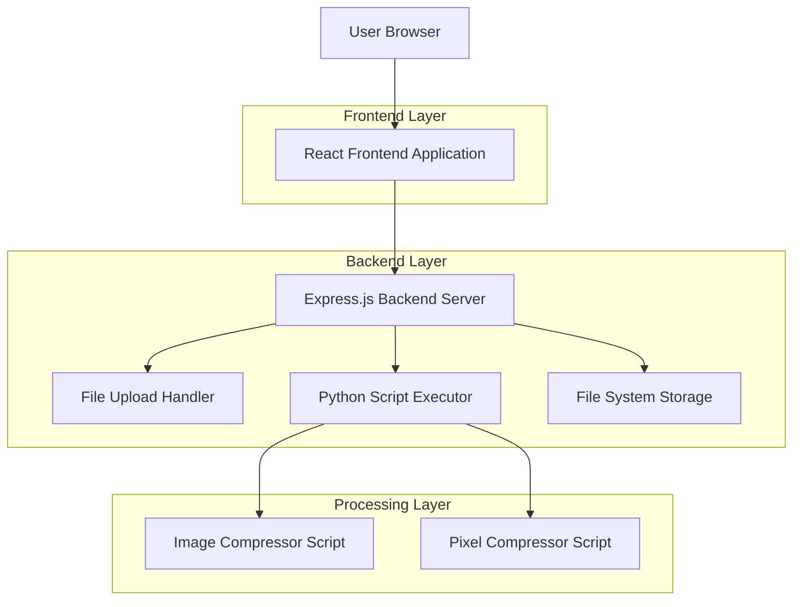
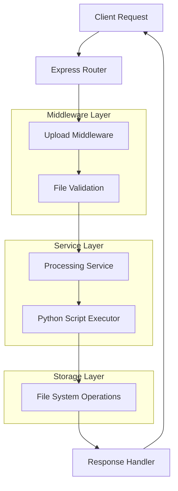
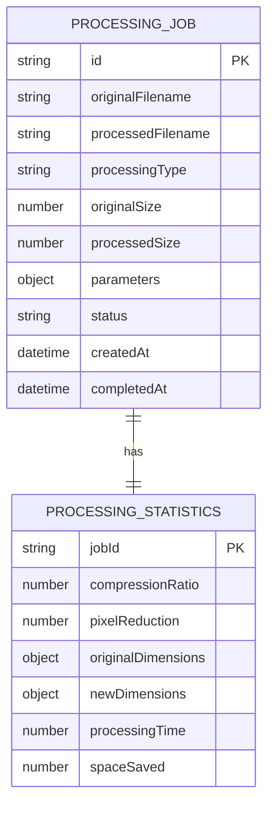

# Image Processing Web Application - Technical Architecture Document

## 1. Architecture Design



## 2. Technology Description

- Frontend: React@18 + tailwindcss@3 + vite + axios
- Backend: Express@4 + multer + child_process + cors
- File Processing: Python scripts (existing image_compressor.py and pixel_compressor.py)
- File Storage: Local file system with temporary upload/output directories

## 3. Route Definitions

| Route | Purpose |
|-------|---------|
| / | Home page with upload interface and processing type selection |
| /upload | File upload endpoint for image processing |
| /process | Processing page with real-time status updates |
| /results/:id | Results page displaying processed image and statistics |
| /download/:filename | Secure file download endpoint for processed images |

## 4. API Definitions

### 4.1 Core API

File upload and processing
```
POST /api/upload
```

Request (multipart/form-data):
| Param Name | Param Type | isRequired | Description |
|------------|------------|------------|-------------|
| image | File | true | JPG/JPEG image file to process |
| processingType | string | true | "quality" or "pixel" compression type |
| quality | number | false | JPEG quality (1-100) for quality compression |
| percentage | number | false | Resize percentage (1-100) for pixel compression |
| maxWidth | number | false | Maximum width in pixels for pixel compression |
| maxHeight | number | false | Maximum height in pixels for pixel compression |
| maintainAspect | boolean | false | Maintain aspect ratio for pixel compression |

Response:
| Param Name | Param Type | Description |
|------------|------------|-------------|
| success | boolean | Processing success status |
| processId | string | Unique identifier for this processing job |
| originalSize | number | Original file size in bytes |
| processedSize | number | Processed file size in bytes |
| compressionRatio | number | Compression ratio percentage |
| originalDimensions | object | Original image width and height |
| newDimensions | object | Processed image width and height |
| downloadUrl | string | URL to download processed image |
| statistics | object | Detailed processing statistics |

Example Response:
```json
{
  "success": true,
  "processId": "img_1234567890",
  "originalSize": 2457600,
  "processedSize": 567300,
  "compressionRatio": 76.9,
  "originalDimensions": { "width": 1920, "height": 1080 },
  "newDimensions": { "width": 1920, "height": 1080 },
  "downloadUrl": "/api/download/img_1234567890_processed.jpg",
  "statistics": {
    "pixelReduction": 0,
    "spaceSaved": 1890300,
    "processingTime": 1.2
  }
}
```

Get processing status
```
GET /api/status/:processId
```

Response:
| Param Name | Param Type | Description |
|------------|------------|-------------|
| status | string | "processing", "completed", "failed" |
| progress | number | Processing progress percentage (0-100) |
| message | string | Current processing step or error message |

File download
```
GET /api/download/:filename
```

Response: Binary file data with appropriate headers for download

## 5. Server Architecture Diagram



## 6. Data Model

### 6.1 Data Model Definition



### 6.2 Data Definition Language

Since this application uses in-memory storage for temporary processing jobs, no persistent database is required. However, the data structures used in the application are:

Processing Job Object:
```javascript
const processingJob = {
  id: 'img_' + Date.now() + '_' + Math.random().toString(36).substr(2, 9),
  originalFilename: 'uploaded_image.jpg',
  processedFilename: 'processed_image.jpg',
  processingType: 'quality', // or 'pixel'
  originalSize: 2457600,
  processedSize: 567300,
  parameters: {
    quality: 85,
    percentage: null,
    maxWidth: null,
    maxHeight: null,
    maintainAspect: true
  },
  status: 'completed', // 'processing', 'completed', 'failed'
  createdAt: new Date(),
  completedAt: new Date(),
  statistics: {
    compressionRatio: 76.9,
    pixelReduction: 0,
    originalDimensions: { width: 1920, height: 1080 },
    newDimensions: { width: 1920, height: 1080 },
    processingTime: 1.2,
    spaceSaved: 1890300
  }
};
```

File Storage Structure:
```
uploads/
├── temp/           # Temporary uploaded files
├── processed/      # Processed output files
└── cleanup/        # Files scheduled for deletion
```